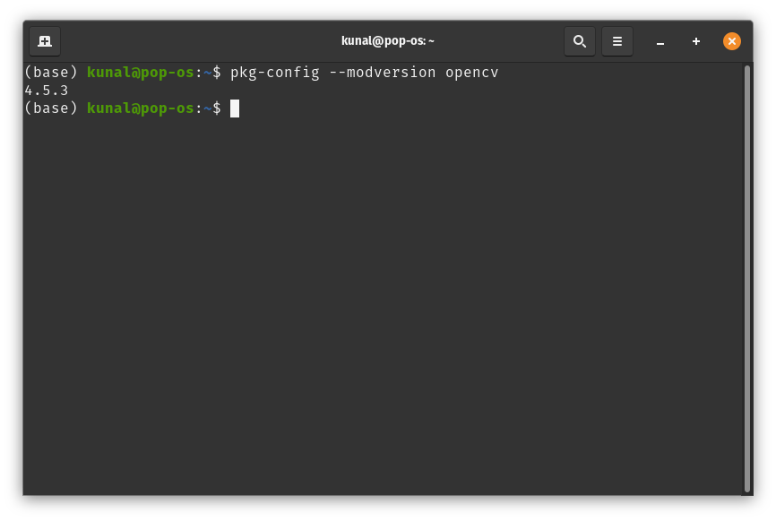
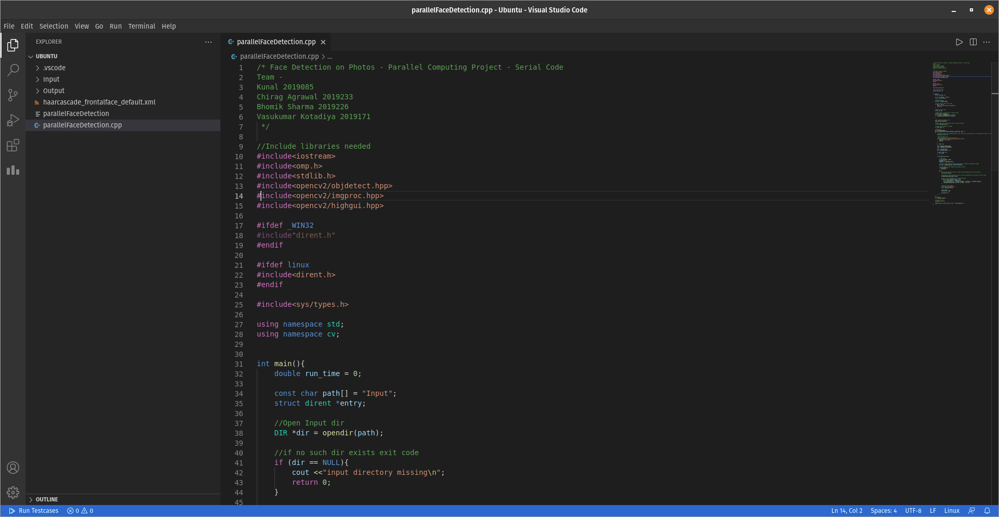
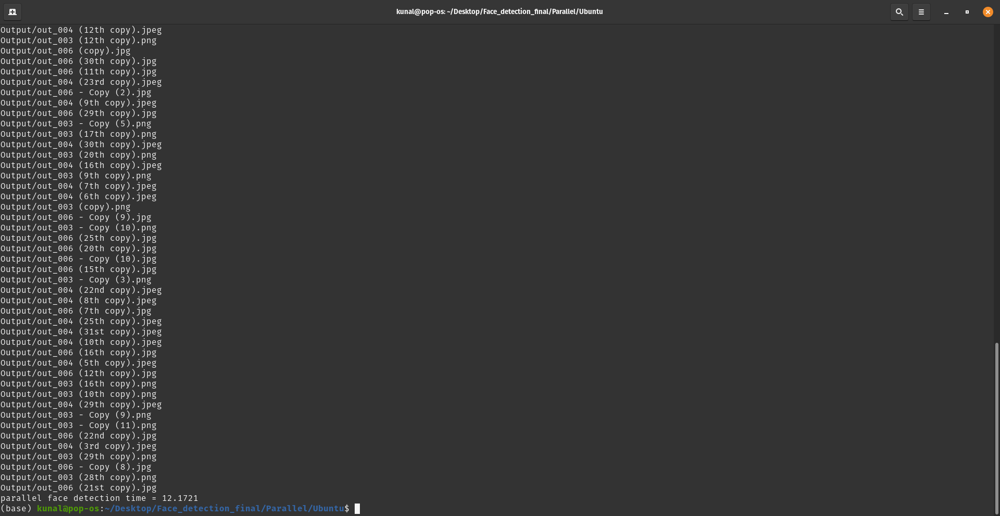

# Setup to run the code

## 1. [Install OpenCV](http://www.codebind.com/cpp-tutorial/install-opencv-ubuntu-cpp/)
## 2. Check Install -  
### run this command in terminal :
### pkg-config --modversion opencv
### output should look like this

## 3. [Install VSCode](https://itsfoss.com/install-visual-studio-code-ubuntu/)
## 4. [Install OpenMP](https://medium.com/swlh/openmp-on-ubuntu-1145355eeb2)
## 5. Open VSCode and open the Serial/Ubuntu folder in it.
## 6. Open parallelFaceDetection.cpp

## 7. Press ctrl+shift+c in vscode to open terminal in that folder
## 8. run - "g++ -fopenmp serialFaceDetection.cpp -o serialFaceDetection `pkg-config --cflags --libs opencv4` && ./serialFaceDetection" in Terminal
## 9. The code will output all detected files and the time of execution
