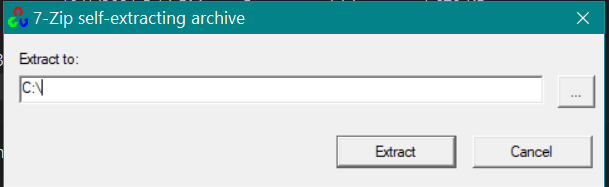
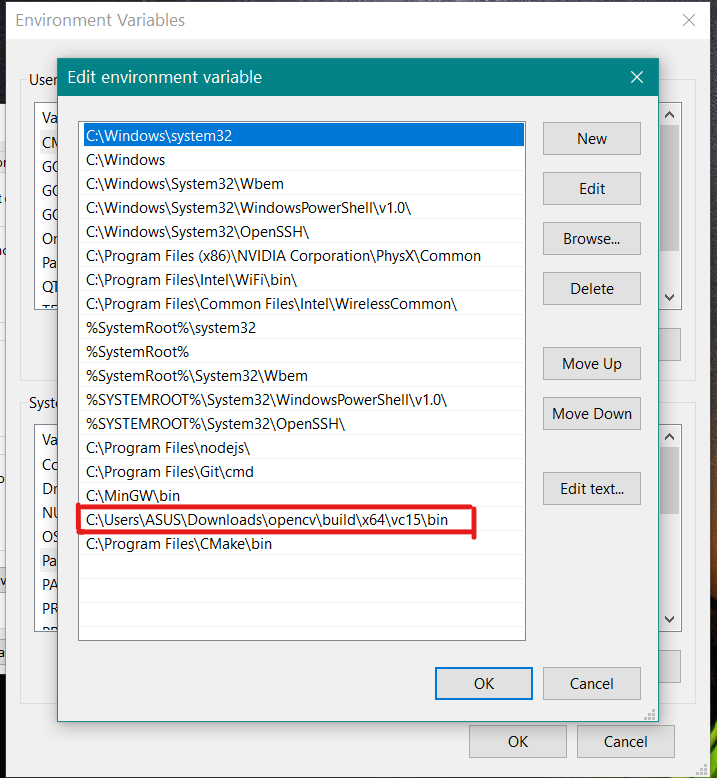

# Install OpenCV

### Download Link - https://opencv.org/releases/  

### Step 1: Download thw windows version of OpenCV  

### Step 2: "opencv-4.5.3-vc14_vc15.exe" file will be downloaded  

### Step 3: Run the executable file. Give the extract location as the C drive  

### Step 4: Add the path "C:\opencv\build\x64\vc15\bin" in environment path variable  

