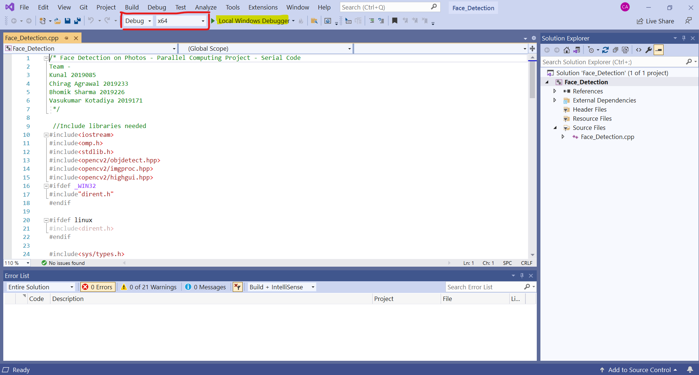
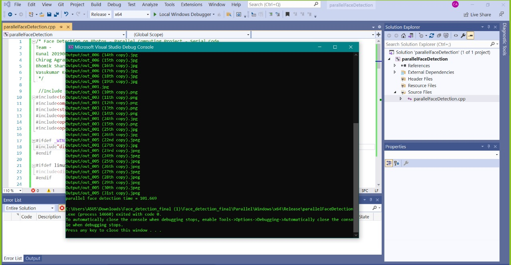

# Setting up for this project

## 1. [Install OpenCV Library 4.5.3](OpenCV.md)
## 2. [Install VisualStudio](VisualStudio.md)
## 3. [Install OpenMP](https://medium.com/swlh/openmp-on-ubuntu-1145355eeb2)

# How to run?

## 1: Open the file Face_Detection.sln (Windows/parallelFaceDetection.sln) in visual studio community.

## 2: Make sure there are input images in the Input Folder(Windows/parallelFaceDetection/Input/) folder. (present in the same folder as Face_Detection.cpp)

## 3: In the Top bar change Debug to "Release" and Click on Local Windows Debugger in the top bar. This will compile and run the program.
        
## 4: You will be able to see the final output images with detected faces in the Output Folder(Windows/parallelFaceDetection/Output/) folder. (present in the same folder as parallelFaceDetection.cpp)

## Output -

### Note : All the output images will be saved in the Output folder. 