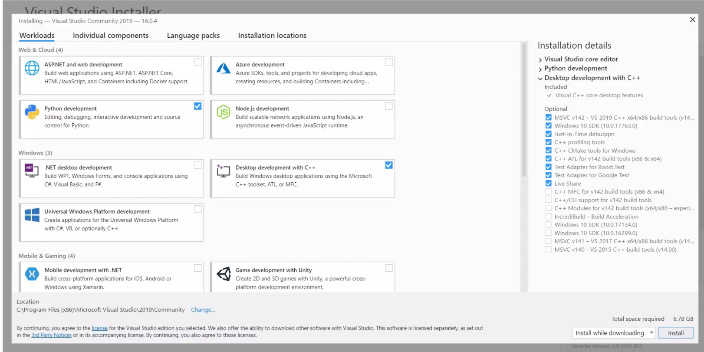

# Install Visual Studio 2019

### Download Link - https://visualstudio.microsoft.com/downloads/  

### Step 1: Download the community version of Visual Studio 2019  

### Step 2: "vs_community__771029820.1633097530.exe" file will be downloaded.  

### Step 3: Run the executable file and complete the installation.  

### Step 4: Follow the installation guide at https://docs.microsoft.com/en-us/cpp/build/vscpp-step-0-installation?view=msvc-160 to install Visual Studio workloads to support c/c++.  

