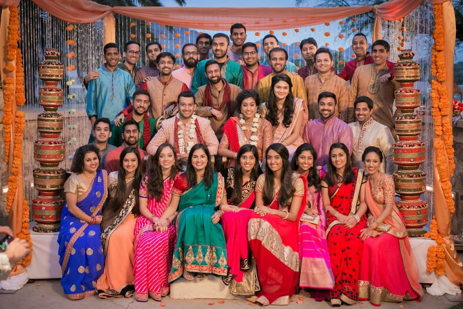
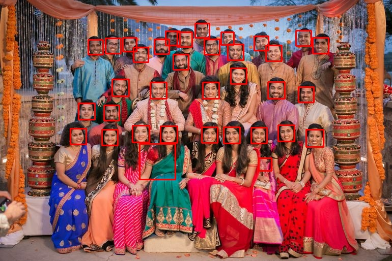

# Face Detection on Photos - Parallel Computing Project - Serial Code  

#### Note: Preview readme in vscode after opening press ctrl+shift+v   

## Introduction  
The following project detects all the faces in all the pictures stored in Input folder. All the detected faces are outline with a rectangule.  
The output image is stored in the Output Folder with a suffix - "out_" in the input file name.  
The project uses openCV in c++ to detect faces.  

## Example  

### Input File -  

### Output File -  

## How to run ?

### 1. [In Ubuntu](Instructions/Ubuntu/Ubuntu_Guide.md)
### 2. [In Windows](Instructions/Windows/Windows_Guide.md)   

# Team Members -  
### Kunal 2019085
### Chirag Agrawal 2019233
### Bhomik Sharma 2019226
### Vasukumar Kotadiya 2019171   